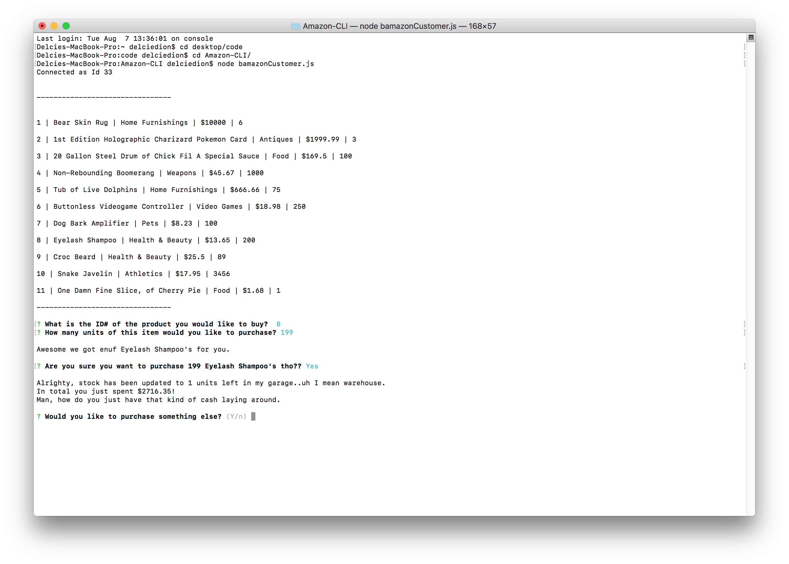
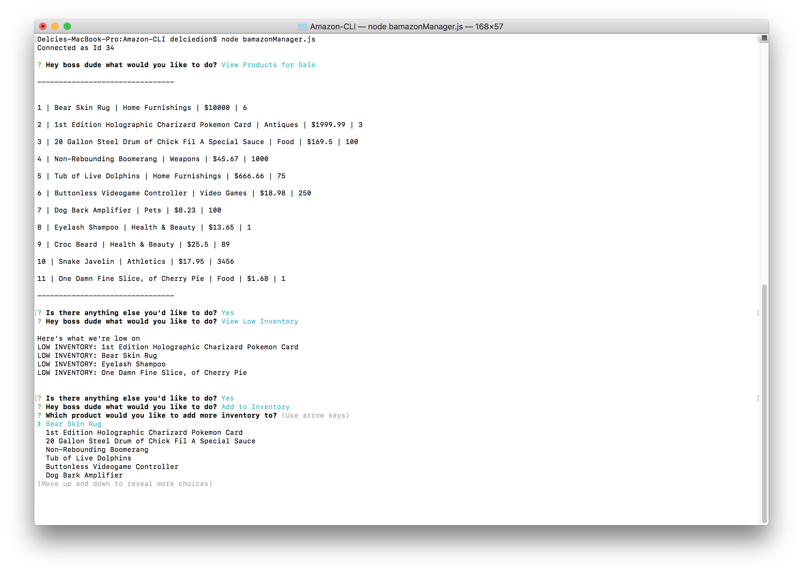

# Amazon-CLI

- Clone repo.
- Run command in Terminal or Gitbash 'npm install'
- Run command depending which mode you would like to be on:

    * Customer - node bamazonCustomer.js
    * Manager - node bamazonManager.js

### What Each JavaScript Does

1. `bamazonCustomer.js`

    * Prints the products in the store.

    * Prompts customer which product they would like to purchase by ID number.

    * Asks for the quantity.

      * If there is a sufficient amount of the product in stock, it will return the total for that purchase.
      * However, if there is not enough of the product in stock, it will tell the user that there isn't enough of the product.
      * If the purchase goes through, it updates the stock quantity to reflect the purchase.
      * It will also update the product sales in the department table.

      

-----------------------

2. `BamazonManager.js`

    * Starts with a menu:
        * View Products for Sale
        * View Low Inventory
        * Add to Inventory
        * Add New Product

    * If the manager selects `View Products for Sale`, it lists all of the products in the store including all of their details.

    * If the manager selects `View Low Inventory`, it'll list all the products with less than 10 items in its StockQuantity column.

    * If the manager selects `Add to Inventory`, it allows the manager to select a product and add inventory.

    * If the manager selects `Add New Product`, it allows the manager to add a new product to the store.

    
